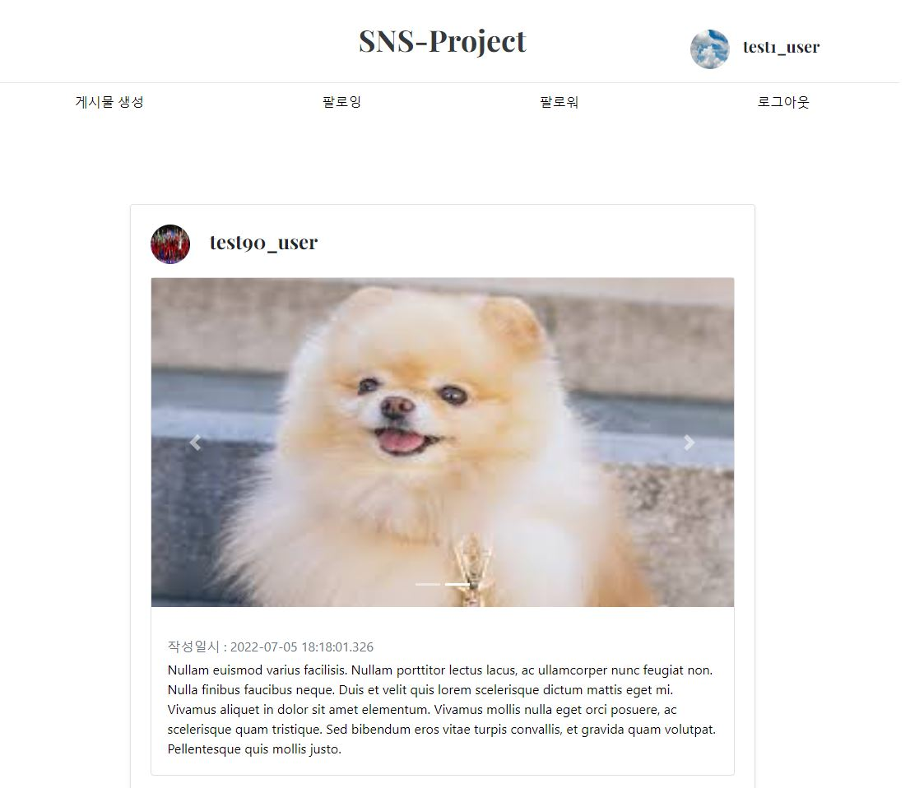
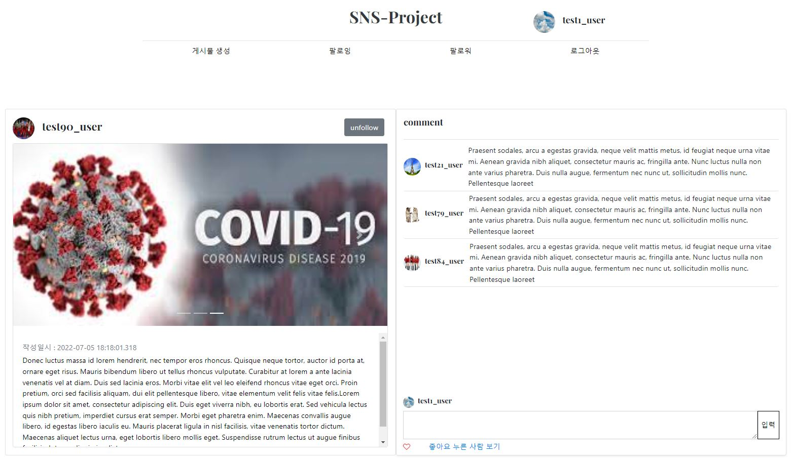
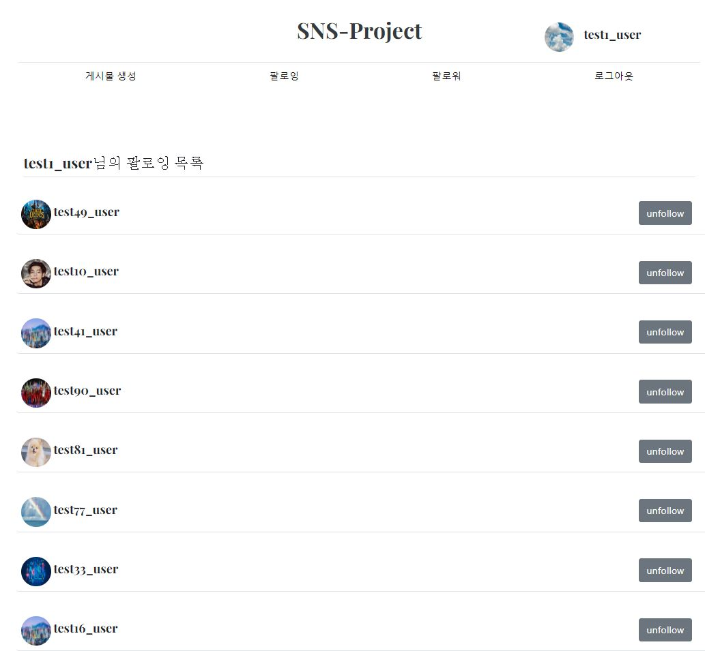

# SNS_Project

Instagram 클론 코딩 프로젝트
- 개인 백엔드 연습 프로젝트

사용 기술 : Spring, Spring Security, JPA(h2 db), Thymeleaf, Bootstrap 

1. 메인 화면

2. 게시글 화면

3. 팔로워 화면

## Member
- 멤버(유저) 가입 및 로그인 기능
- 멤버끼리 팔로우(Follow) 기능

## Board
- 보드 업로드, 수정삭제 등 기능
- 보드 좋아요(Like) 기능

## Data
- 프로필 이미지 또는 보드 안에 들어갈 텍스트와 이미지 실제 저장 기능
- 간단한 파일 시스템 이용
- (미구현) AWS Storage 시스템 이용

## Etc
- Home Controller로 entrypoint 생성
- Spring Security를 이용하여 로그인 기능 구현
- (미구현) OAuth2 지원
- (미구현) Docker-compose와 Nginx를 이용하여 Linux 서버로 배포
- (미구현) Elastic Search 이용하여 보드 찾기
- (미구현) 보드 추천 시스템 이용

## TODO  
- [x] Hashmap memory db & Simple login/signup page (baseline)   
- [x] Member Service/Controller/Repository Baseline   
- [x] Board Service/Controller/Repository Baseline
- [x] JPA
- [x] Spring Security
- [x] Like, Follow Implement
- [x] Front, Thymeleaf, Bootstrap
- [x] File Upload
- [ ] OAuth2